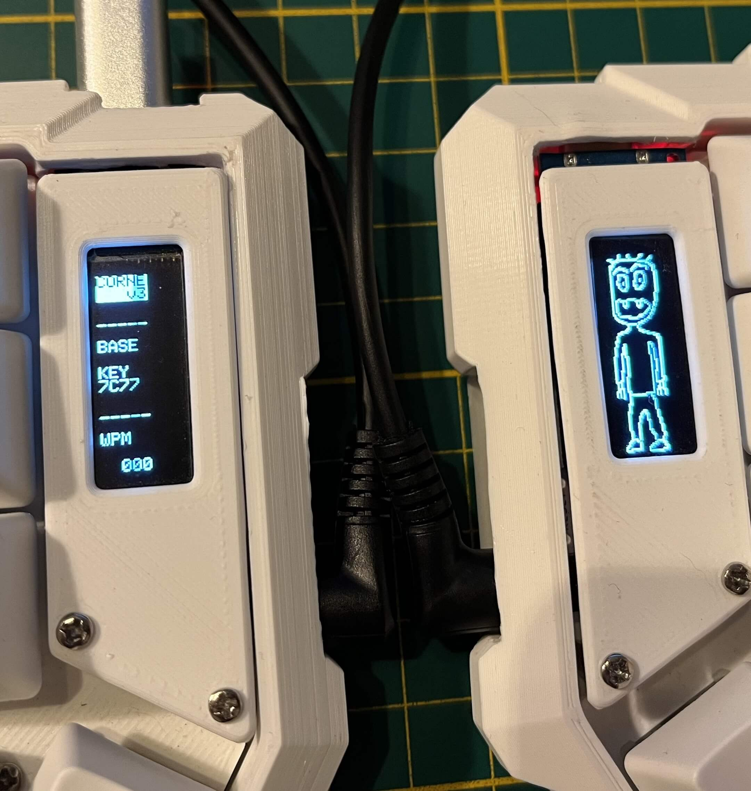

# Corne keyboard key mapping and firmware

In this repo I keep my custom files related to my v3 [Corne keyboard](https://github.com/foostan/crkbd).

It contains 2 parts:
- My key mapping - file `crkbd.layout.json`
- My custom firmware keymaps - catalog `my_keymap`
- Compiled firmware - file `crkbd_rev1_my_keymap.hex`

## Key mapping
To load key mapping into your Corne keyboard you can use [Via](https://usevia.app/) web app.

## Firmware
To flash your keyboard with the firmware you need to:

- Install and setup [QMK Firmawe](https://docs.qmk.fm/)
- Install [QMK Toolbox app](https://qmk.fm/toolbox)
- Clone [qmk_firmware repo](https://github.com/qmk/qmk_firmware)
- Paste my custom keymap into `qmk_firmware/keyboards/crkbd/keymaps/` folder
- Run `qmk compile -kb crkbd -km my_keymap` to compile the firmware. File with new firmware will be ready in the root of `qmk_firmware` repo
- Open QMK Toolbox app
- Flash firmware into your keyboard via USB, first and second module separately

In this firmware:
- LED lighting is disabled
- Remapping is posible with Via
- OLED displays shows custom text on the left side and custom picture on the right
- Left OLED shows WPM counter
- OLED screens are turn off after 30 seconds of inactivity
- Flag `#define SPLIT_USB_DETECT` is added to recognize correctlly both modules with every microcontroller (some cheap Pro Micros have a problem with connection without this flag)

